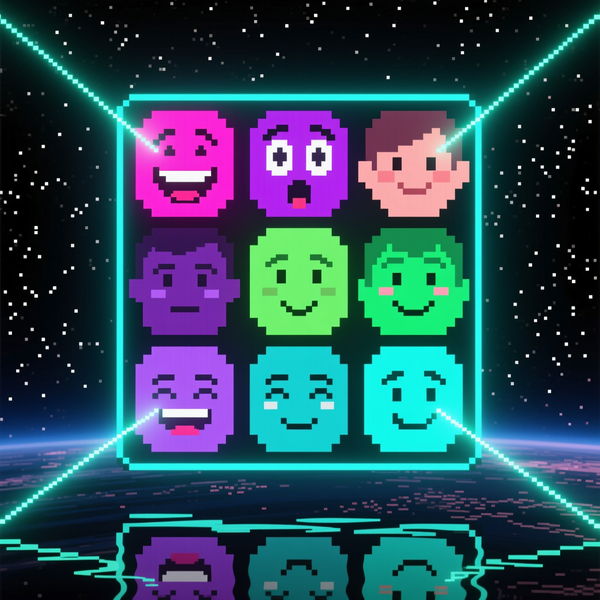
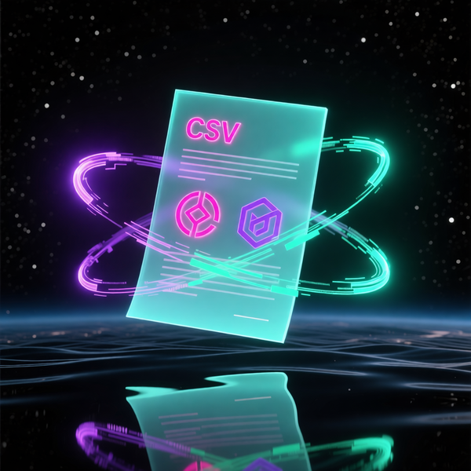
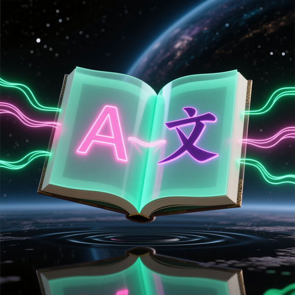
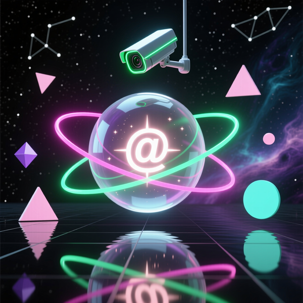
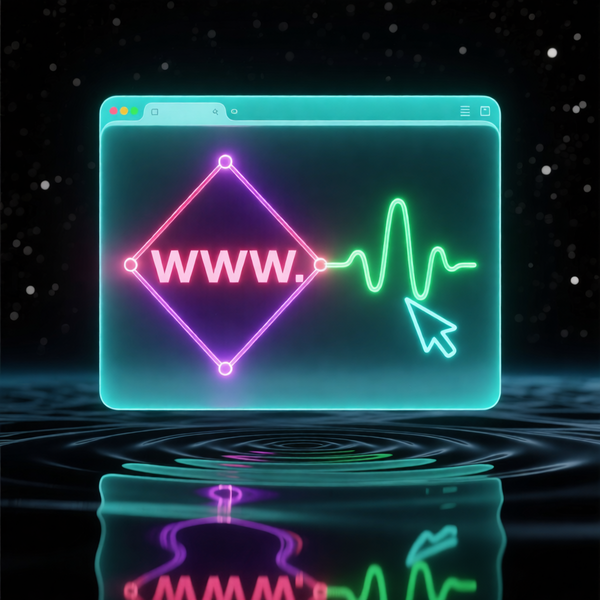

# Basic Collection
### Роботы для базового управления группой в Telegram
Мемы · Игры · Информация · Переводы · Взаимодействие  

Подборка ботов для базового управления и вовлечения участников в Telegram-группах: активность, развлечения, сбор данных и поддержка пользователей.
Последнее обновление: 31.01.2026

---

<table style="width: 100%; border-collapse: collapse; margin-bottom: 20px;">
  <tr>
    <td style="vertical-align: top; width: 0; padding: 0;">
      
    </td>
    <td style="vertical-align: top; padding-left: 15px;">
      <h3 style="margin-top: 0;">Spam</h3>
      
$15

    </td>
  </tr>
</table>
Запускает дружеские мемы и флешмобы, поддерживая активность без лишнего шума

---

<table style="width: 100%; border-collapse: collapse; margin-bottom: 20px;">
  <tr>
    <td style="vertical-align: top; width: 0; padding: 0;">
      
    </td>
    <td style="vertical-align: top; padding-left: 15px;">
      <h3 style="margin-top: 0;">Oracle</h3>
      
$15

    </td>
  </tr>
</table>
Выдаёт случайные фразы о техногенезе и эволюции кода, как импульсы для размышлений

---

<table style="width: 100%; border-collapse: collapse; margin-bottom: 20px;">
  <tr>
    <td style="vertical-align: top; width: 0; padding: 0;">
      
    </td>
    <td style="vertical-align: top; padding-left: 15px;">
      <h3 style="margin-top: 0;">Face</h3>
      
$15

    </td>
  </tr>
</table>
Генерирует стилизованные лица по команде, учитывая эмоцию сообщения

---

<table style="width: 100%; border-collapse: collapse; margin-bottom: 20px;">
  <tr>
    <td style="vertical-align: top; width: 0; padding: 0;">
      
    </td>
    <td style="vertical-align: top; padding-left: 15px;">
      <h3 style="margin-top: 0;">Info</h3>
      
$15

    </td>
  </tr>
</table>
Сохраняет ID группы и темы, чтобы другие боты знали, куда отправлять данные

---

<table style="width: 100%; border-collapse: collapse; margin-bottom: 20px;">
  <tr>
    <td style="vertical-align: top; width: 0; padding: 0;">
      
    </td>
    <td style="vertical-align: top; padding-left: 15px;">
      <h3 style="margin-top: 0;">Clock</h3>
      
$15

    </td>
  </tr>
</table>
Показывает время в разных часовых поясах для быстрой синхронизации команды

---

<table style="width: 100%; border-collapse: collapse; margin-bottom: 20px;">
  <tr>
    <td style="vertical-align: top; width: 0; padding: 0;">
      
    </td>
    <td style="vertical-align: top; padding-left: 15px;">
      <h3 style="margin-top: 0;">ADM</h3>
      
$15

    </td>
  </tr>
</table>
Формирует список администраторов с правами в удобном csv формате

---

<table style="width: 100%; border-collapse: collapse; margin-bottom: 20px;">
  <tr>
    <td style="vertical-align: top; width: 0; padding: 0;">
      
    </td>
    <td style="vertical-align: top; padding-left: 15px;">
      <h3 style="margin-top: 0;">Translator</h3>
      
$15

    </td>
  </tr>
</table>
Мгновенно переводит сообщения в чате, сохраняя смысл и тон

---

<table style="width: 100%; border-collapse: collapse; margin-bottom: 20px;">
  <tr>
    <td style="vertical-align: top; width: 0; padding: 0;">
      
    </td>
    <td style="vertical-align: top; padding-left: 15px;">
      <h3 style="margin-top: 0;">IA</h3>
      
$15

    </td>
  </tr>
</table>
Отвечает на вопросы прямо в чате как локальный ИИ-помощник

---

<table style="width: 100%; border-collapse: collapse; margin-bottom: 20px;">
  <tr>
    <td style="vertical-align: top; width: 0; padding: 0;">
      
    </td>
    <td style="vertical-align: top; padding-left: 15px;">
      <h3 style="margin-top: 0;">User</h3>
      
$15

    </td>
  </tr>
</table>
Собирает данные об участниках: статус, дата входа и наличие username

---

<table style="width: 100%; border-collapse: collapse; margin-bottom: 20px;">
  <tr>
    <td style="vertical-align: top; width: 0; padding: 0;">
      
    </td>
    <td style="vertical-align: top; padding-left: 15px;">
      <h3 style="margin-top: 0;">Chess</h3>
      
$15

    </td>
  </tr>
</table>
Позволяет играть в шахматы в чате с проверкой ходов и обновлением доски

---

<table style="width: 100%; border-collapse: collapse; margin-bottom: 20px;">
  <tr>
    <td style="vertical-align: top; width: 0; padding: 0;">
      
    </td>
    <td style="vertical-align: top; padding-left: 15px;">
      <h3 style="margin-top: 0;">Link</h3>
      
$15

    </td>
  </tr>
</table>
Публикует ссылки после оплаты для платных анонсов и размещения рекламы

---

<table style="width: 100%; border-collapse: collapse; margin-bottom: 20px;">
  <tr>
    <td style="vertical-align: top; width: 0; padding: 0;">
      
    </td>
    <td style="vertical-align: top; padding-left: 15px;">
      <h3 style="margin-top: 0;">QRCode</h3>
      
$15

    </td>
  </tr>
</table>
Создаёт QR-код по ссылке для быстрого сканирования со смартфона

---

🧭 О коллекции

Basic — это набор базовых ботов для эффективного управления и развлечения в Telegram-группах.  
Каждый бот выполняет свою роль: от публикации мемов и генерации контента до мониторинга участников и автоматизации процессов. Коллекция подходит для любых групп, которым нужен порядок, активность и интерактив.
